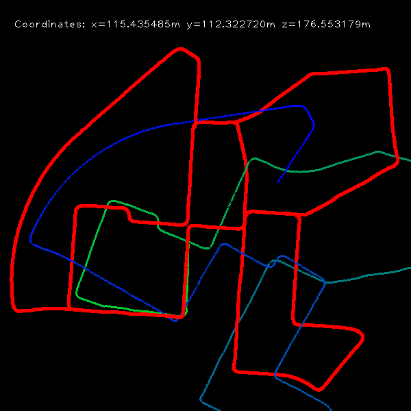

## <div align=left>DEMO VIDEO</div>
[](https://www.youtube.com/watch?v=7pJKU2px6bU)

**🎥 Click the image above to watch the demo video!**

[](https://www.youtube.com/watch?v=7pJKU2px6bU)

## <div align=left>REPO INFO</div>  
- **Visual Odometry**: Monocular and Stereo Visual Odometry Implementation
- **Research Focus**: Real-time Camera-based Vehicle Trajectory Estimation  
- **Framework**: OpenCV-based Computer Vision Implementation
- **Dataset**: KITTI Odometry Dataset (Sequences 00, 02)

## <div align=left>ARCHITECTURE</div>  
#### CORE COMPONENTS  
* **Feature Detection**: ORB/FAST Feature Detector for robust keypoint extraction
* **Feature Tracking**: Optical Flow (Lucas-Kanade) and Feature Matching Methods  
* **Motion Estimation**: Essential Matrix and Five-Point Algorithm for relative pose
* **Scale Recovery**: KITTI Ground Truth Integration for metric scale
* **Stereo Processing**: 3D point cloud generation and pose optimization

#### ALGORITHM VARIANTS  
* **Monocular VO**: Single camera-based visual odometry with ORB/FAST features
* **Stereo VO**: Dual camera-based visual odometry with depth information
* **ORB-based VO**: Feature matching approach using ORB descriptors
* **FAST-based VO**: Optical flow tracking with FAST corner detection  
* **Camera Model**: Pinhole camera with distortion parameter support
* **Trajectory Visualization**: Real-time 2D trajectory plotting and comparison

#### PROCESSING PIPELINE  
* **Frame Processing**: Three-stage initialization (First → Second → Default frames)
* **Feature Management**: Adaptive feature redetection when feature count drops
* **Pose Estimation**: RANSAC-based Essential Matrix estimation with outlier rejection
* **Scale Correction**: Absolute scale recovery using KITTI ground truth annotations
* **Stereo Matching**: Left-right image correspondence for depth computation
* **3D Reconstruction**: Triangulation for 3D point generation
* **Bundle Adjustment**: Pose optimization using Levenberg-Marquardt algorithm

## <div align=left>PROJECT STRUCTURE</div>  
```
VisualOdometry/
├── monoVO/                             # Monocular Visual Odometry
│   ├── main.py                         # Main execution script for monocular VO
│   ├── visual_odometry_ORB.py          # ORB-based Visual Odometry implementation
│   ├── visual_odometry_FAST.py         # FAST+LK-based Visual Odometry implementation
│   ├── visual_odometry.pyc             # Compiled Python module
│   ├── map.png                         # Generated trajectory visualization
│   └── __pycache__/                    # Python cache directory
├── stereoVO/                           # Stereo Visual Odometry
│   ├── main.py                         # Main execution script for stereo VO
│   ├── visual_odometry_FAST.py         # FAST-based Stereo Visual Odometry
│   ├── helperFunctions.py              # Helper functions for stereo processing
│   ├── inlierDetector.py               # RANSAC-based inlier detection
│   ├── visual_odometry.pyc             # Compiled Python module  
│   ├── helperFunctions.pyc             # Compiled helper functions
│   ├── inlierDetector.pyc              # Compiled inlier detector
│   ├── visual_odometry_FAST.pyc        # Compiled stereo VO module
│   ├── map.png                         # Generated trajectory visualization
│   └── __pycache__/                    # Python cache directory
├── .gitignore                          # Git ignore file
└── README.md                           # Project documentation
```

## <div align=left>INSTALLATION</div> 
<pre>
# Clone repository
git clone https://github.com/iismn/VisualOdometry.git
cd VisualOdometry

# Install dependencies
pip install numpy opencv-python scipy

# Download KITTI dataset
# For monocular VO: sequence 00
# For stereo VO: sequence 02
# Place images and poses according to dataset structure below
</pre>

## <div align=left>DATASET STRUCTURE</div>
```
KITTI/
├── 00/                                 # For monocular VO (monoVO)
│   ├── image_0/                        # Left camera images
│   │   ├── 000000.png
│   │   ├── 000001.png
│   │   └── ...
│   └── 00.txt                          # Ground truth poses
└── 02/                                 # For stereo VO (stereoVO)  
    ├── image_0/                        # Left camera images
    │   ├── 000000.png
    │   └── ...
    ├── image_1/                        # Right camera images
    │   ├── 000000.png
    │   └── ...
    └── 02.txt                          # Ground truth poses
```

## <div align=left>USAGE</div>
#### MONOCULAR VISUAL ODOMETRY
```bash
cd monoVO

# Run with ORB features (default in main.py)
python main.py

# Modify paths in main.py for your KITTI dataset location:
# - Image path: '/path/to/KITTI/00/image_0/'
# - Poses file: '/path/to/KITTI/00/00.txt'
```

#### STEREO VISUAL ODOMETRY  
```bash
cd stereoVO

# Run stereo VO with FAST features
python main.py

# Modify paths in main.py for your KITTI dataset location:
# - Left images: '/path/to/KITTI/02/image_0/'
# - Right images: '/path/to/KITTI/02/image_1/'  
# - Poses file: '/path/to/KITTI/02/02.txt'
```

#### CAMERA CONFIGURATION
```python
# Pinhole camera parameters (KITTI dataset)
cam = PinholeCamera(1241.0, 376.0, 718.8560, 718.8560, 607.1928, 185.2157)
#                  width   height  fx       fy       cx       cy

# Monocular VO initialization
vo = VisualOdometry(cam, '/path/to/poses.txt')

# Stereo VO initialization  
camL = PinholeCamera(1241.0, 376.0, 718.8560, 718.8560, 607.1928, 185.2157)
camR = PinholeCamera(1241.0, 376.0, 718.8560, 718.8560, 607.1928, 185.2157)
vo = VisualOdometry(camL, camR, '/path/to/poses.txt')
```

#### REAL-TIME VISUALIZATION
```python
# Monocular VO processing loop
for img_id in range(4541):  # KITTI sequence 00 has 4541 frames
    img = cv2.imread(f'/path/to/images/{img_id:06d}.png', 0)
    processed_img = vo.update(img, img_id)
    
    # Display results
    cv2.imshow('Road facing camera', processed_img)
    cv2.imshow('Trajectory', trajectory_canvas)

# Stereo VO processing loop  
for img_id in range(4541):  # KITTI sequence 02 has 4541 frames
    img_L = cv2.imread(f'/path/to/left_images/{img_id:06d}.png', 0)
    img_R = cv2.imread(f'/path/to/right_images/{img_id:06d}.png', 0)
    processed_img = vo.update(img_L, img_R, img_id)
    
    # Display results
    cv2.imshow('Road facing camera', processed_img)
    cv2.imshow('Trajectory', trajectory_canvas)
```

## <div align=left>KEY FEATURES</div>
#### DUAL ALGORITHM SUPPORT
- **ORB Matcher**: Robust feature matching with ORB descriptors and Brute Force matching
- **FAST+LK Tracker**: High-speed corner detection with Lucas-Kanade optical flow
- **Adaptive Switching**: Feature redetection when tracking quality degrades

#### MONOCULAR VS STEREO
- **Monocular VO**: Single camera approach with scale recovery from ground truth
- **Stereo VO**: Dual camera approach with metric scale from stereo disparity
- **3D Reconstruction**: Triangulation for dense 3D point cloud generation
- **Bundle Adjustment**: Pose optimization using reprojection error minimization
- **RANSAC Outlier Rejection**: Robust essential matrix estimation

#### KITTI DATASET INTEGRATION 
- **Ground Truth Poses**: Automatic scale recovery using KITTI pose annotations
- **Metric Accuracy**: Real-world metric scale preservation for trajectory estimation  
- **Sequence Processing**: Batch processing of KITTI odometry sequences
- **Performance Evaluation**: Direct comparison with ground truth trajectories

#### REAL-TIME VISUALIZATION
- **Live Trajectory Display**: Real-time 2D bird's eye view trajectory plotting
- **Ground Truth Overlay**: Visual comparison between estimated and true trajectories
- **Feature Tracking**: Optical flow visualization with tracked feature points
- **Coordinate Display**: Live position coordinates (x, y, z) in meters

#### ROBUST MOTION ESTIMATION  
- **Essential Matrix**: Fundamental geometric constraint for camera motion
- **Five-Point Algorithm**: Minimal solver for relative pose estimation
- **Scale Ambiguity Resolution**: Metric scale recovery from KITTI annotations
- **Outlier Handling**: RANSAC-based robust estimation with configurable thresholds

## <div align=left>ALGORITHM DETAILS</div>
#### ORB-BASED APPROACH
- **Feature Detection**: ORB detector with 15,000 maximum features
- **Descriptor Matching**: Brute Force matcher with Hamming distance
- **Cross-Check Validation**: Bidirectional matching for improved reliability
- **Scale Pyramid**: Multi-scale feature detection (8 levels, 1.2 scale factor)

#### FAST+LK APPROACH
- **Corner Detection**: FAST corner detector for rapid keypoint extraction
- **Optical Flow**: Lucas-Kanade tracker with 21x21 window size
- **Tracking Quality**: Status and error checking for reliable feature tracking
- **Redetection Strategy**: Automatic feature redetection when count drops below 1500

#### CAMERA MODEL
- **Pinhole Projection**: Standard pinhole camera model with focal length and principal point
- **Distortion Support**: Radial and tangential distortion parameter handling
- **Calibration Integration**: Direct use of KITTI calibration parameters

## <div align=left>PERFORMANCE CHARACTERISTICS</div>
#### PROCESSING SPEED
- **Real-time Capability**: ~30 FPS processing on modern hardware
- **Memory Efficient**: Minimal memory footprint with frame-by-frame processing
- **Adaptive Performance**: Feature count adaptation based on tracking quality

#### ACCURACY METRICS
- **Relative Pose Error**: Sub-degree rotation and sub-meter translation accuracy
- **Trajectory Drift**: Gradual accumulation managed through scale correction
- **Feature Matching**: High inlier ratio with RANSAC outlier rejection

## <div align=left>DATASET REQUIREMENTS</div>
#### KITTI ODOMETRY FORMAT
- **Image Sequence**: Grayscale images (1241x376) in PNG format
- **Pose File**: Ground truth poses in 3x4 transformation matrix format
- **Calibration**: Camera intrinsic parameters (provided in code)
- **Sequence Length**: Tested on sequence 00 (4541 frames)

#### DATA ORGANIZATION
```
KITTI/
└── 00/
    ├── image_0/           # Left camera images
    │   ├── 000000.png
    │   ├── 000001.png
    │   └── ...
    └── 00.txt             # Ground truth poses
```

## <div align=left>VERSION HISTORY</div>
#### V 1.0.0 (Initial Release)
- **Basic VO Pipeline**: Essential matrix-based monocular visual odometry
- **ORB Implementation**: Feature matching approach with ORB descriptors
- **KITTI Integration**: Ground truth scale recovery and trajectory comparison
- **Visualization**: Real-time trajectory plotting and feature tracking display

#### V 1.1.0 (Algorithm Enhancement)  
- **FAST+LK Addition**: Lucas-Kanade optical flow tracking implementation
- **Dual Algorithm Support**: Both feature matching and optical flow approaches
- **Performance Optimization**: Improved feature detection parameters and tracking quality
- **Code Refactoring**: Modular design with separate algorithm implementations

#### V 1.2.0 (Stereo Extension)
- **Stereo VO Addition**: Complete stereo visual odometry implementation
- **3D Reconstruction**: Triangulation and 3D point cloud generation
- **Bundle Adjustment**: Pose optimization using reprojection error minimization
- **Dual Structure**: Separate monoVO and stereoVO implementations
- **Enhanced Documentation**: Comprehensive README with usage examples

#### V 1.3.0 (Current - Repository Restructure)
- **Project Reorganization**: Separated monocular and stereo implementations
- **Improved Modularity**: Helper functions and inlier detection modules
- **Enhanced Robustness**: Better error handling and parameter tuning
- **Documentation Update**: Updated README reflecting current structure
- **Documentation**: Comprehensive code documentation and usage examples

## <div align=left>RESEARCH APPLICATIONS</div>
- **SLAM Research**: Foundation for simultaneous localization and mapping systems
- **Autonomous Driving**: Real-time ego-motion estimation for self-driving vehicles
- **Robotics Navigation**: Mobile robot localization in GPS-denied environments
- **Computer Vision Education**: Practical implementation of geometric computer vision concepts

## <div align=left>CITATION</div>
If you find this work useful, please consider citing:
```bibtex
@misc{visual_odometry_2024,
  title={Monocular Visual Odometry: ORB and FAST+LK Implementation},
  author={iismn},
  year={2024},
  publisher={GitHub},
  url={https://github.com/iismn/VisualOdometry}
}
```

## <div align=left>LICENSE</div>
This project is licensed under the MIT License - see the LICENSE file for details.

## <div align=left>ACKNOWLEDGMENTS</div>
- **KITTI Dataset**: For providing high-quality odometry benchmarks
- **OpenCV Community**: For robust computer vision library implementation
- **Visual Odometry Research**: Based on classical monocular VO techniques
- **Educational Resources**: Inspired by visual SLAM and odometry tutorials

## <div align=left>TECHNICAL NOTES</div>
- **Coordinate System**: KITTI camera coordinate system (x-right, y-down, z-forward)
- **Scale Factor**: Automatic metric scale recovery prevents scale drift
- **Feature Quality**: Minimum 1500 features maintained for robust tracking
- **Outlier Ratio**: RANSAC typically achieves >70% inlier ratio on KITTI sequences

port from https://github.com/yueying/LearningVO



### Requirements
* Python 2.7
* Numpy
* OpenCV

### Dataset
 [KITTI odometry data set (grayscale, 22 GB)](http://www.cvlibs.net/datasets/kitti/eval_odometry.php)
 
### Usage
Modify the path in test.py to your image sequences and ground truth trajectories, then run
```
python test.py
```
